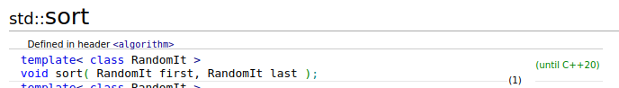

# The C++ Standard Template Library

---

## O que é e porque ligar?

- Grande ToolKit de tipos e funções
- Containers
- Algoritmos
- C++ > C (na maratona)


## O que é esse tal de template?

- Tipos e funções com "buracos"

```cpp
// definição da função
template <class T1, class T2>
T1 my_function(T1 x, T1 y, T2 z) {
	cout << z;
	return x + y;
}

// uso
my_function<int, char>(10, 20, '+');

my_function<double, string>(1.1, 2.2, "plus");

```




---

# Containers

---

## `std::vector<T>`

- Vetor Dinâmico
- size vs capacity
- vector != vetor


Criando um `std::vector`

```cpp
// vector vazio
vector<int> numbers;

// vector com 10 elementos vazios
vector<string> names(10);

// vector com 3 7s
vector<long long> lucky(3, 7);
vector<long long> also_lucky = {7, 7, 7};

// evitar:
vector<string> bad[10];
```


Acessando um `std::vector`

```cpp
vector<int> numbers(10);
cout << numbers.size(); // 10

for (int i = 0; i < 10; i++) {
	numbers[i] = 100 * i;
	cout << numbers[i];
}

// ponteiros também funcionam
int* p = &numbers[0];
cout << *(p + 1); // 100
```


`.push_back()`

```cpp
vector<int> numbers;
numbers.reserve(10);

cout << numbers.size(); // 0

for (int i = 0; i < 10; i++) {
	numbers.push_back(i * 100);
}

cout << numbers.size(); // 10
```


`.reserve()` vs `.resize()`

```cpp
vector<int> numbers(3);
cout << numbers.size() << endl
     << numbers.capacity() << endl;
     
numbers.resize(10);
cout << numbers.size() << endl
     << numbers.capacity() << endl;
     
     
numbers.reserve(20);
cout << numbers.size() << endl
     << numbers.capacity() << endl;
```

---

## `std::pair<T1,T2>` 


- Tipo muito simples que consiste de dois elementos de tipo `T1` e `T2`
- Caso particular do `std::tuple`

```
pair<double, double> bhaskara(double a, double b, double c) {
	double delta = b * b - 4 * a * c;
	double sqrt_delta = sqrt(delta);

	return {(- b + sqrt_delta) / (2 * a),
	        (- b - sqrt_delta) / (2 * a)};
}

pair<double, double> result = bhaskara(1, -7, 12);

cout << result.first << '\n'; // 3
cout << result.second << '\n'; // 4

```


``` 
pair<int, int> x = {10, 200};
pair<int, int> y = {20, 100};
pair<int, int> z = {10, 100};

cout << x < y << '\n' // true
     << x < z << '\n' // false
     << y < z << '\n'; // false

``` 


```
tuple<int, double, char> pies = make_tuple(3, 3.14, 'P');

cout << get<0>(pies) << '\n';
cout << get<1>(pies) << '\n';
cout << get<2>(pies) << '\n';
```

---

### Práticas comuns em STL


## `auto`

```
long long x = 10; // long long
auto y = x; // long long
auto z = y + 1.0; // double

auto k; // <- erro

vector<int> get_some_vector();

auto v = get_some_vector(); // vector<int>
// v = 10 <- erro

```


## Iteração

```cpp
vector<int> v = get_some_vector();

for (int x : v) {
	cout << x << '\n';
}

for (auto x : v) {
	cout << x << '\n';
}

for (auto &x: v) {
	cout << x << '\n';
}

```

---

#### Iterators

Valores que nos permitem acessar um elemento específico numa estrutura de dados


`begin()`, `*`, `++`

```
vector<int> v = {10, 20, 30, 40};

auto t = begin(v);
cout << *t << '\n'; // 10

t++;
cout << *t << '\n' // 20

t++;
cout << *t << '\n' // 30

t--;
cout << *t << '\n' // 20
```


`end()`, `==`

```
vector<int> v = {10, 20, 30};

auto t = begin(v);
cout << t == begin(v) << '\n';

t++;
cout << *t << '\n'; // 20
t++;
cout << *t << '\n'; // 30

cout << t == end(v) << '\n'; // false

t++;
cout << t == end(v) << '\n' // true
```


Opcional: `+`, `-`

```
vector<int> v = {4, 0, 6, 1, 3, 5, 7};

auto t = begin(v);

cout << *(t + 2) << '\n'; // 6

cout << *t << '\n'; // 4

t = end(v) - 1;

cout << *t << '\n'; // 7;

cout << t - begin(v) << '\n' // ;
```

---

### `<algorithm>`

Conjunto [enorme](https://en.cppreference.com/w/cpp/header/algorithm) de funções de utilidade.


#### Casos Notáveis

`sort`, `reverse`

```cpp
vector<string> terms = {"Use", "Words", 
                        "For", "Variable", "Names"};

sort(begin(terms), end(terms));

for (auto &term : terms) { cout << term << '\n'; }
// For Names Use Variable Words

reverse(begin(terms), end(terms));

for (auto &term : terms) { cout << term << '\n'; } 
// Words Variable Use Names For
```


`lower_bound`, `upper_bound`, `binary_search`

- `binary_search`

```cpp
vector<int> fibs = {0,1,1,2,3,5,8,13,21,34,55,89,144,233};

bool result = binary_search(begin(fibs), end(fibs), 13);

cout << result << "\n"; // true

result = binary_search(begin(fibs), end(fibs), 14);

cout << result << "\n"; // false
```


- `lower_bound`

```cpp
vector<int> fibs = {0,1,1,2,3,5,8,13,21,34,55,89,144,233};

auto iterator = lower_bound(begin(fibs), end(fibs), 13);

cout << *iterator << "\n";  // 13

iterator++;

cout << *iterator << "\n";  // 21

```

```cpp 
vector<int> fibs = {0,1,1,2,3,5,8,13,21,34,55,89,144,233};

auto iterator = lower_bound(begin(fibs), end(fibs), 13);

cout << *iterator << "\n";  // 21

iterator = upper_bound(begin(fibs), end(fibs), 13);

cout << *iterator << "\n";  // 13
```


---

# Mensagens de erro

<span style="color: red;">Preparem-se.</span>


```
int main() {

    map<string, set<string>> m;

    cout << m;

    return 0;
}

```

Mais de 220 linhas de erro no GCC12.2.1

---

### Fim.

Dúvidas?
